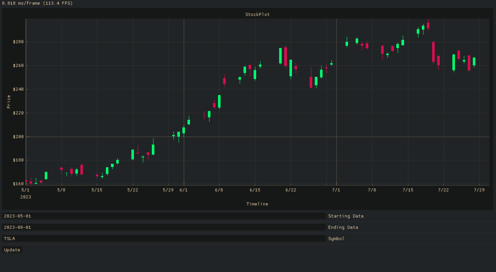

<h1 align="center">
YUI Ⱓ
</h1>

<p align="center">
A simple Stock Price Visualizer ⚖️. All data is sourced from Yahoo Finance.
</p>

## Demo

<p align="center">
  
</p>

## Build From Source

The project is using `meson` and `ninja` as the build system. Current `meson.build` is only tested on MacOS. To build the project, you need to have `meson` and `ninja` installed. Then run the following commands:

```
$ meson setup build
$ meson compile -C build
```

The executable will be located at `build/yui`.

If you are on Linux or Windows, you need to adjust the `meson.build` file to include the correct libraries. For more information, please refer to the [meson documentation](https://mesonbuild.com/).
